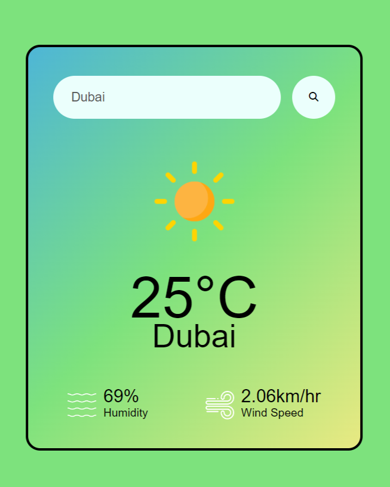

# Weather App

</img>

## Tech Stack
- HTML
- CSS
- JavaScript
- Openweather API

## Why I Made This Project

I created the Weather App as a learning project to explore and enhance my skills in web development. The primary goals of the project were:

1. **Learning about APIs** 

2. **Web Development Practice**

3. **Real-world Application** 

## How to Use
1. Clone the repository.
2. Open `index.html` in your preferred web browser.

Feel free to explore the code, make improvements, and customize it to suit your needs!